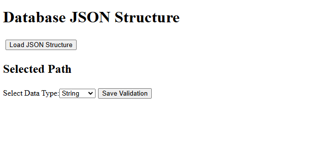
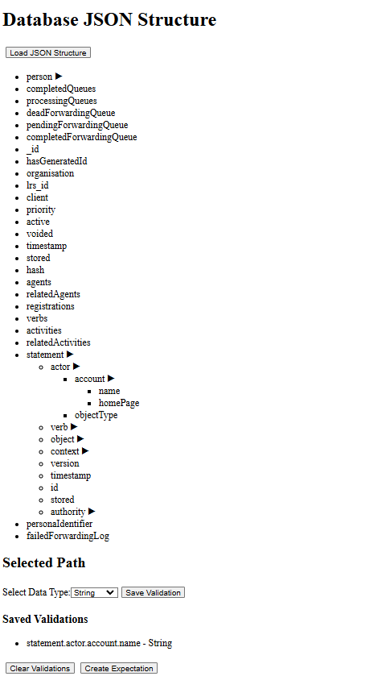

# Definition, Validation and Evaluation of Data Veracity Level Aggrements 

### How to start the application

1. Open two terminal

- First in the Backend folder and run the following code:

```bash
gradle run

```

2. In the second terminal:

- Open Frontend/val folder and run:

```bash
npm install
npm run serve
```


At localhost:8081 a Vue.js App is running now, here show it should look: 



Hit the Load JSON Structure, then you can see the keys, where you can add a Expectations, if you clikc in one of those you can select it.

Then you can see at the Selected Path, that it writes the Path you choose and if you choose a Data Type that you want it to be, and hit Save Validation, it will save it.



Then you can add more path if you want, and if you selected all the path you want hit Create Expectation, or if you want to start over hit Clear Validations.

If you hit Create Expectations, you should get a messaeage that the Expectation created succesfully, and you can find the expectations.json at Backend/app/expectations.json.